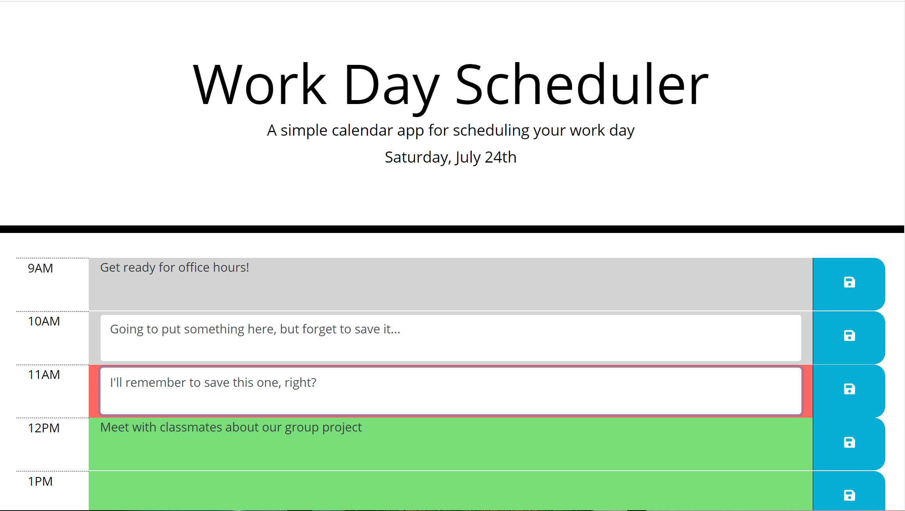

# Workday Scheduler
This fifth challenge for the Coding Bootcamp is to use modify an existing framework to present a workday schedule and allow the user to edit the events

[Requirements](#requirements)

[Requirement Mockup](#requirementMockup)

[Notes about the Requirements](#requirementNotes)

[What I Learned](#whatILearned)

[Workday Scheduler Screenshot](#webImage)

[Workday Scheduler URL](#projectURL)

[Contact Me](#contactMe)

---

## Requirements
<ul>
<li> The current day is displayed at the top of the calendar.</li>
<li> When the user scrolls down, they are presented with time blocks for standard business hours.</li>
<li> When the user views the time block for that day, they are color coded to indicate whether it is in the past, present or future.</li>
<li> When the user clicks into a time block, they can enter the event to change the description.</li>
<li> When the user refreshes the page, the saved events persist.</li>
</ul>

---

## Requirement Mockup

---

## Notes about the Requirements
<ul>
<li> Neither the assignment description nor the mockup indicate what to do if the schedule is left up and the time changes such that the past/present/future colors should change. I use a timer to refresh the colors at the top of each hour.</li>
<li> In the assignment description, it says "The starter code uses the Moment.js library to work with date and time, but feel free to use a different JavaScript solution to handle this functionality since Moment.js is considered a 'legacy' project."</li>
Further down in the assignment description, under Technical Acceptance Criteria, it says "Uses the moment.js library to work with date and time." I chose to use moment.js.
<li> Neither the mockup nor the assignment description shows what happens if the user edits a second event without saving the first event. Given that each hour has it's own save button, it seems clear that the an event should not be saved unless the save button for that hour is clicked. This could lead to multiple events being edited, but not saved. The mockup does not show any feedback to the user that they have unsaved events. I changed how an edited-but-not-yet-saved event looks so the user knows which events still need saving. In the real world, I'd verify the desired behavior with the user.</li>
<li> It looks like this scheduler is only for one day - there's no way shown in the mockup to switch to a different day. I can enter a bunch of events for today, and those are saved to localStorage. When I open the app again tomorrow, those same events will be displayed. This somewhat makes sense, since many business days follow roughly the same schedule. In the real world, I'd verify the desired behavior with the user.</li>
</ul>

---

## I learned...
* More about using third-party APIs, specifically Bootstrap, jQuery, and moment.js (although moment.js isn't supported any more - still good stuff learned for using other date/time resources)
* How to perform DOM traversals and manipulations with jQuery
* How to use jQuery to save user input to local storage.
* How to work with Bootstrap's grid layout
* How to override colors (and other attributes) in an existing CSS framework
* How to work with custom fonts and icons through CDNs, including Font Awesome
---

## Workday Scheduler Screenshot

---

## Workday Scheduler URL

[Workday Scheduler URL](https://bjackels5.github.io/workday-scheduler/)

---

## Contact Me
You can reach me, Brenda Jackels, at bjackels5@gmail.com.
